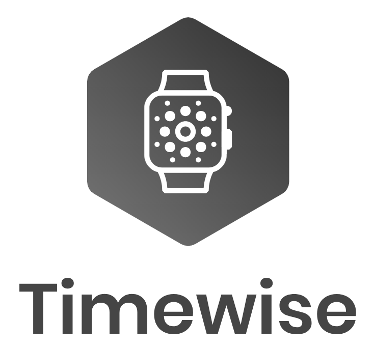

# Timewise E-commerce Watch Website

## 📜 Short Description

Welcome to our E-commerce Watch Website project! This academic endeavor showcases our skills in developing a comprehensive web application for online watch shopping. Dive into our exploration of watch inventory management, secure payments, and dynamic user experiences.

## 👥 Team Members

1. **Ashutosh Laley**
   - **GitHub:** [AshuLaley](https://github.com/AshuLaley)

2. **Tejas Dhikale**
   - **GitHub:** [TejasDhikale](https://github.com/tejasdikle)

3. **Sumedh Gaikwad**
   - **GitHub:** [SumedhGaikwad](https://github.com/sumedh-gaikwad)

4. **Ghanshyam Gurnule**
   - **GitHub:** [GhanshyamGurnule](https://github.com/shyam286)

5. **Rohan Gajbhare**
   - **GitHub:** [RohanGajbhare](https://github.com/cloud9-anon)

## 🌐 Project Guide

- **Vinu Josy**
  - **Role:** Project Guide

## 🚀 Tech Stack

- **Backend:** Spring Boot, MySQL, Spring Security
- **Frontend:** React, Tailwind CSS
- **Additional Tools:** Razorpay API, Docker (Optional)

## ⚙️ How to Run

1. **Clone the repository.**
2. **Navigate to the backend directory and run the application.**
3. **Navigate to the frontend directory, install dependencies, and run the application.**

Make sure to follow any additional setup instructions mentioned in the backend and frontend README files.

## 📄 License

This project is part of our academic coursework and is not open for external contributions. It is licensed under the [MIT License](LICENSE).

---
